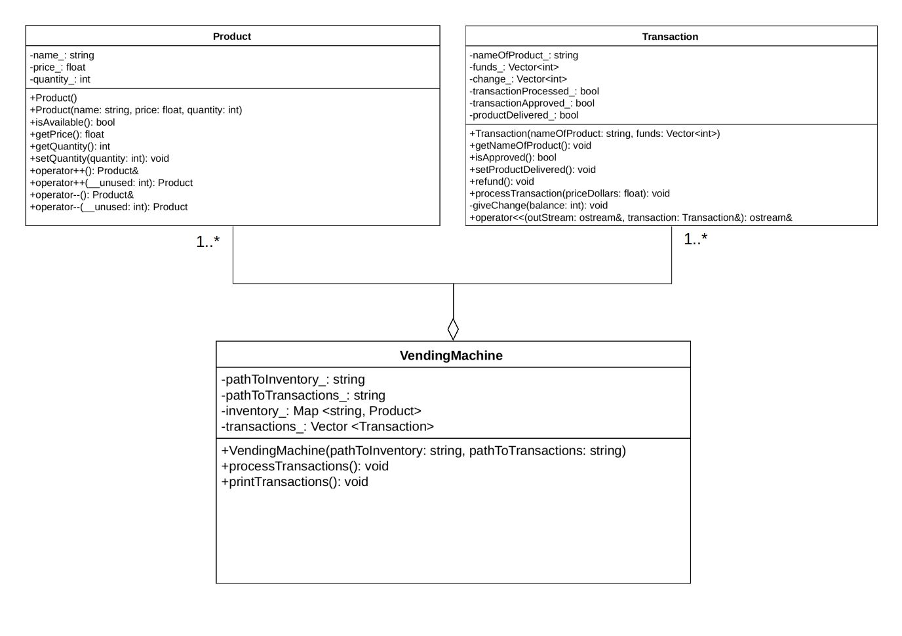

# Vending Machine

- El Hafidi, Badr
- Georgia Institute of Technology
- [badr@gatech.edu](mailto:badr@gatech.edu)
- [badr.el.hafidi@gmail.com](mailto:badr.el.hafidi@gmail.com)
- GitHub: <https://github.com/ziinux/projects/tree/master/vending_machine>

## Specifications

We want to code a software for a vending machine that will do the following tasks:

- Reads the inventory file (JSON)
- Reads the transactions file (JSON)
- Processes the transactions
- Outputs a JSON file  containing a list of transaction results.

Thus, the program will be given two command-line arguments. The first argument is the
path to the inventory JSON file.  The second argument is the path to the transactions
JSON file:

- Inventory: specifies how the vending machine is stocked, with product names,
  and a quantity and price (in dollars) for each product
- Transactions: a list of purchase transactions, with the product name, and the
  value (in cents) of coins deposited

The program outputs one JSON file, on stdout, containing the transactions’ result:
* Transactions’ result: a list containing the result of the purchase transactions processed, with the product name, whether a product was delivered, and the change given, as a list of coin values.

## Implementation

### Assumptions

This software design use the following assumptions:

1. The JSON inventory file should respect the following format:
```
{
	"name of product": {
  	"quantity": quantity_of_product,
	  "price": price_of_product
	}
}
```
   - ***name of product***: is a **string** and all characters are allowed in the name of the product.
   - quantity_of_product: Must be a strictly positive integer (> 0). It is the number of units of that product available in the vending machine.
   - price_of_product: Must be a strictly positive float (>0). It is the price for one unit of that product in dollars.


2. The JSON transactions file should respect the following format:
```
[
    {
      "name": "name of product",
      "funds": [
      coin_1,
      coin_2,
      coin_3
      ]
    }
]
```
   - ***name of product***: is a **string** and all characters are allowed in the name of the product.
   - **funds**: is a list of values, in **cents**, of coins inserted by the user of the vending machine. 1 cents is equal to 0.01 dollar. This list is not required to be sorted.
   - ***coin_X***: Must be a **strictly positive integer** (> 0) and can only be one of the following values = ***{5,25,100}***. It is the value of the coin number X inserted by the user in the vending machine.


3. The JSON output file respects the following format:
```
[
  {
    "name": "name of product",
    "product_delivered": true or false,
    "change": [
      coin_1,
      coin_2
    ]
  }
]
```
   - ***name of product***: is a **string** and all characters are allowed in the name of the product.
   - ***product_delivered***: the value is = ***true***, if the product is delivered and it is = ***false***, otherwise.
   - **change**:  is a list of values, in **cents**, of coins given back to the user, as change, at the end of the transaction. 1 cents is equal to 0.01 dollar. The list is **sorted in ascending order**, from smallest to largest coins.
   - ***coin_X***: Must be a **strictly positive integer** (> 0) and can only be one of the following values = ***{5,25,100}***. It is the value of the coin number X given back to the user of the vending machine at the end of the transaction.


4. We assume that the vending machine has an **infinity of coins {5,25,100}** that are used to give change to the user.
   - The current design does not take in consideration the available coins inside the vending machine used for change.

### Software architecture
The program is implemented using C++.

The software architecture used is described in the following UML class diagram:



The program uses 3 classes:
- **Product**: the Product class represents a product in the vending machine, it has the name, price and quantity of that product. The Product is instantiated for each product in the JSON inventory file. This instantiation is done in the constructor of the VendingMachine.  
- **Transaction**: the Transaction class represents a transaction initiated by the user of the vending machine. The Transaction is instantiated for each transaction in the JSON transactions file. This instantiation is done in the constructor of the VendingMachine.       
    - The operation ***processTransaction()*** processes the transaction and takes as argument the corresponding price of the product named in the transaction.   
    - The ***operator<<*** was overloaded for the class Transaction in order to output the result of the transaction in the correct JSON format.
- **VendineMachine**: the VendineMachine class represents the actual vending machine. It reads the JSON inventory file and the JSON transactions file and build a hash table of (key=name_of_product,value=Product) called ***inventory_*** and a dynamic array of Transaction called ***transactions_***.
   - The operation ***processTransactions()*** processes all the transactions in the dynamic array transactions_ using the operation processTransaction() of the class Transaction.
   - The operation ***printTransaction()*** uses the overloaded ***operator<<*** of the class Transaction to output, in stdout, the result of the transaction that includes the name of the product, whether the product was delivered, and the change given.

In the UML class diagram, the classes **Product** and **Transaction** have a relationship of ***multiplicity*** 1..\* and ***aggregation*** to the class **VendineMachine**.
- The class **VendineMachine** is formed of one or more **Product**s and one or more **Transaction**s
- The contained classes **Product** and **Transaction** are not strongly dependent on the life cycle of the container class **VendineMachine**, that's why the relation is an aggregation and not a composition.

## How to run the code ?

You will need to install rapidJson library http://rapidjson.org/.

For ubuntu use the following command:
```
sudo apt-get install rapidjson-dev
```
The program is in the `cpp` directory. To compile it use the following commands:
```
cd cpp/build
rm -r *
cmake ../
make
```

To run the program use the folowing command
```
cd cpp/build
./VendingMachine <path_to_inventory_json_file> <path_to_transactions_json_file>
```

To test the vending machine program using predefined test scenarios, use the run_tests.py script with Python 3.x:
```
python3 run_tests.py
```
You can add more test scenarios in the `test` directory.
